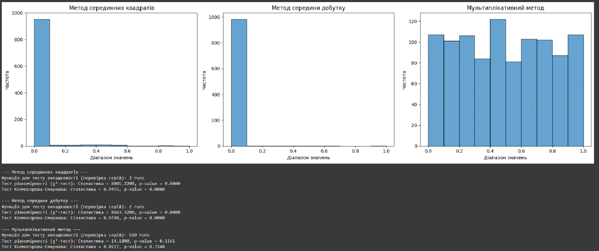

# 🎲 Random Number Generation & Statistical Quality Analysis
*Data Science Case Study*

## 📌 Overview
This project explores **pseudo-random number generation methods** and evaluates their **statistical quality** using standard randomness tests.

Three methods are implemented:
1. **Middle Square Method**
2. **Middle Product Method**
3. **Multiplicative Congruential Method**

The generated sequences are tested for **uniformity**, **independence**, and **distribution quality**.

---

## 🎯 Business & Analytical Value
Random number generators (RNGs) are the backbone of:
- **Financial simulations** (Monte Carlo, risk modeling)
- **Cryptography & security**
- **Gaming & lottery systems**
- **Machine learning model initialization**

Assessing RNG quality ensures **accuracy**, **fairness**, and **security** in data-driven applications.

---

## 📊 Methodology

### Generation Techniques
- **Middle Square** — iterative squaring with extraction of middle digits.
- **Middle Product** — multiplication of two seeds and middle digits extraction.
- **Multiplicative Congruential** — deterministic modular arithmetic.

### Statistical Tests Applied
- **Runs Test** – checks independence by counting sequence runs.
- **Chi-Square Test** – evaluates uniformity of distribution.
- **Kolmogorov-Smirnov Test** – compares generated data to the ideal uniform distribution.

---

## 📈 Results

### Histograms
Each method’s output is visualized to inspect distribution patterns.

*(Example plot — histograms of generated sequences)*  

---

## 🛠 Tech Stack
- **Python** — NumPy, Matplotlib, SciPy
- **Statistical Testing** — `chisquare`, `kstest`
- **Visualization** — histograms for distribution analysis
